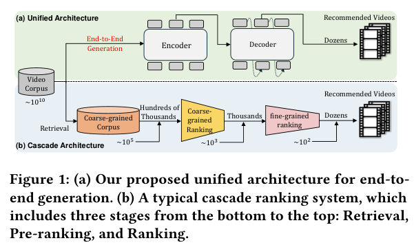
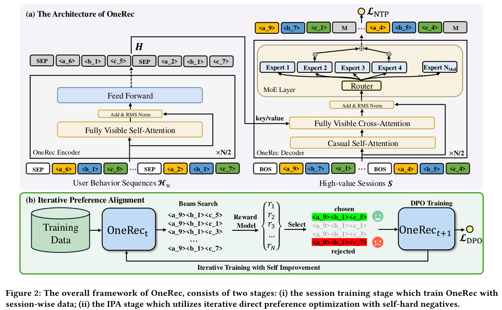
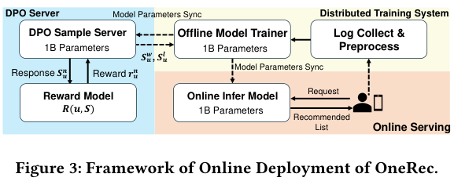
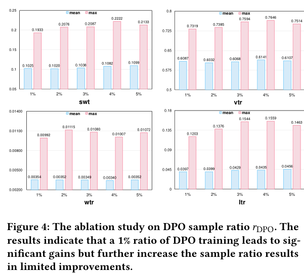
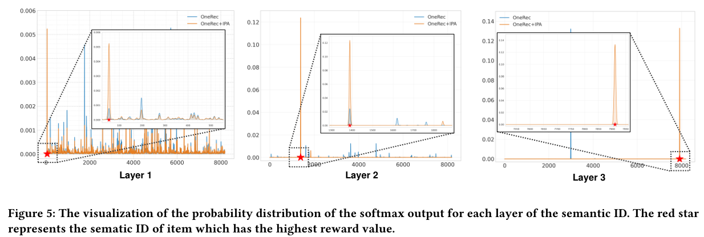
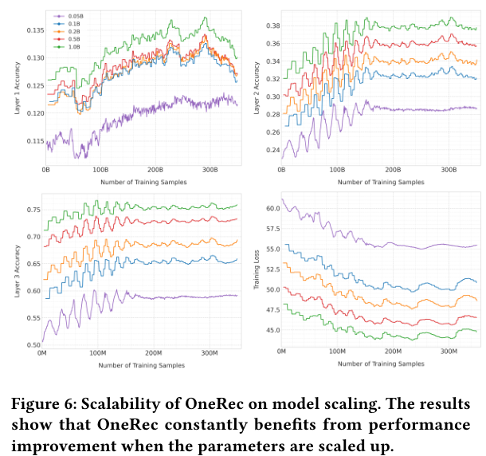

# OneRec：用生成式推荐器统一检索与排序，并结合迭代偏好对齐

## 论文信息
- 原文标题（arXiv 页面）：OneRec: Unifying Retrieve and Rank with Generative Recommender and Iterative Preference Alignment
- PDF 页面标题提取：OneRec: Unifying Retrieve and Rank with Generative Recommender and Preference Alignment
- 作者：Jiaxin Deng, Shiyao Wang, Kuo Cai, Lejian Ren, Qigen Hu, Weifeng Ding, Qiang Luo, Guorui Zhou
- 单位：KuaiShou Inc., Beijing, China
- 来源：arXiv:2502.18965v1 [cs.IR], 2025-02-26
- 原文件：Deng 等 - 2025 - OneRec Unifying Retrieve and Rank with Generative Recommender and Iterative Preference Alignment.pdf
- 贡献说明：`*` 表示 equal contribution，`†` 表示 corresponding author
- 重建说明：正文依据本地 PDF 文本层逐段重建；图 1 到图 6 使用 PDF 页面区域渲染导出到 `assets/`；表 1 与表 2 采用表格重建；参考文献保留原始英文条目，不强制翻译作者名与出版信息。

## 摘要
近年来，基于生成式检索的推荐系统（GRs）通过自回归方式直接生成候选视频，已经成为一个很有前景的范式。然而，大多数现代推荐系统仍采用“检索 + 排序”的策略，其中生成模型只在检索阶段充当选择器。本文提出 OneRec，用统一的生成式模型替代级联式学习框架。据作者所述，这是首个在真实工业场景中显著超越当前复杂且经过精细设计的推荐系统的端到端生成式模型。

具体而言，OneRec 包含三部分：1）编码器 - 解码器结构，用于编码用户历史行为序列，并逐步解码用户可能感兴趣的视频。作者采用稀疏 Mixture-of-Experts（MoE）在不按比例增加 FLOPs 的前提下扩展模型容量。2）session-wise 生成方法。不同于传统的 next-item prediction，作者提出 session-wise generation，它比依赖手工规则逐个组合结果的逐点生成更自然，也更具上下文一致性。3）将迭代偏好对齐模块与 Direct Preference Optimization（DPO）结合，以提升生成结果质量。不同于 NLP 场景中的 DPO，推荐系统对每次用户浏览请求通常只有一次展示机会，因此无法同时获得正负样本。为解决这一问题，作者设计了奖励模型来模拟用户反馈，并结合推荐系统在线学习的属性定制采样策略。大量实验表明，只需有限数量的 DPO 样本，就能使模型对齐用户兴趣偏好，并显著提升生成结果质量。作者将 OneRec 部署到快手主场景中。快手是一个拥有数亿日活用户的短视频推荐平台，OneRec 带来了 1.6% 的观看时长提升，这是一个相当可观的改进。

## CCS Concepts
- Information systems → Computational advertising; Multimedia information systems.

## 关键词
生成式推荐，自回归生成，语义 token 化，Direct Preference Optimization

## ACM Reference Format
Jiaxin Deng, Shiyao Wang, Kuo Cai, Lejian Ren, Qigen Hu, Weifeng Ding, Qiang Luo, and Guorui Zhou. 2018. OneRec: Unifying Retrieve and Rank with Generative Recommender and Preference Alignment. In Proceedings of Make sure to enter the correct conference title from your rights confirmation email (Conference acronym ’XX). ACM, New York, NY, USA, 10 pages. https://doi.org/XXXXXXX.XXXXXXX

## 1 引言
为了同时平衡效率与效果，大多数现代推荐系统采用级联排序策略。如图 1(b) 所示，一个典型的级联排序系统包含三个阶段：召回、预排序和排序。每个阶段从上游结果中选出 top-k 项，并将其传递给下一阶段，从而在系统响应时间与排序准确性之间取得折中。



*图 1：（a）作者提出的端到端统一生成架构。（b）典型的级联排序系统，自下而上包括检索、预排序和排序三个阶段。*

尽管这一做法在实践中高效，但现有方法通常把每个 ranker 分开处理。这样一来，每个独立阶段的效果就会成为后续阶段的上界，从而限制整个排序系统的性能。尽管已有不少工作尝试通过在 ranker 之间建立交互来提升整体推荐效果，它们仍然维持了传统级联排序范式。

近来，生成式检索推荐系统（GRs）通过自回归序列生成方式，直接生成候选 item 的标识符，已经成为一个很有前景的方向。通过使用编码 item 语义信息的量化 semantic ID，对 item 建立索引后，推荐器可以利用 item 内部更丰富的语义信息。GR 的生成特性也使其适合利用 beam search 直接选择候选 item，并带来更丰富多样的推荐结果。然而，现有生成模型仍只被用作检索阶段的选择器，因为它们的推荐准确率还不如精心设计的多级 cascade ranker。

针对上述问题，作者提出名为 OneRec 的统一单阶段端到端生成框架。首先，作者设计了 encoder-decoder 架构。受大语言模型 scaling law 的启发，作者发现扩大推荐模型容量也会持续带来性能提升，因此基于 MoE 结构扩展模型参数量，从而显著提升模型刻画用户兴趣的能力。其次，不同于传统逐点预测下一个 item 的方式，作者提出 session-wise list generation，使模型能够考虑一个 session 内 item 之间的相对内容与顺序关系。逐点生成通常需要大量手工策略来保证结果的一致性与多样性，而 session-wise 学习则可以让模型通过偏好数据自主学习更优的 session 结构。最后，作者探索用 DPO 进行偏好学习，进一步提升生成结果质量。为构造偏好对，作者借鉴 hard negative sampling 的思想，不采用随机采样，而是从 beam search 结果中构造 self-hard rejected samples。进一步地，作者提出 Iterative Preference Alignment（IPA）策略，利用预训练奖励模型（RM）的分数对采样结果排序，从而选出最优 chosen sample 与最差 rejected sample。大规模工业数据上的实验显示，该方法具有明显优势；作者也通过一系列消融实验验证了各模块的有效性。

作者总结的主要贡献包括：
- 为克服级联排序的局限，提出 OneRec 这一单阶段生成式推荐框架。据作者所述，它是最早能在工业场景中用统一生成模型处理 item 推荐并显著超越传统多阶段流水线的方案之一。
- 通过 session-wise 生成强调模型容量与目标 item 上下文信息的重要性，使生成结果更准确，也更具多样性。
- 基于个性化奖励模型提出新的 self-hard negative sample 选择策略，并结合 DPO 提升 OneRec 在更广泛用户偏好上的泛化能力。大量离线实验与在线 A/B 测试共同验证了其有效性和效率。

## 2 相关工作

### 2.1 生成式推荐
近年来，随着生成模型的快速发展，生成式推荐受到越来越多关注。不同于传统基于 embedding 的检索方法，这类方法通常使用 two-tower 模型为每个候选 item 计算排序分数，再通过高效的 MIPS 或 ANN 检索系统返回 top-k 结果。Generative Retrieval（GR）则把“从数据库中检索相关文档”的问题表述为序列生成任务，依次生成文档 token。这些 token 可以是文档标题、文档 ID，或预训练的 semantic ID。

GENRE 最早将 Transformer 用于实体检索，在给定上下文的条件下自回归地生成实体名称。DSI 首次提出给文档分配结构化 semantic ID，并训练 encoder-decoder 模型进行生成式文档检索。沿着这一思路，TIGER 进一步将生成式 item 检索模型用于推荐系统。

除生成框架外，如何给 item 建立索引也引起了越来越多关注。近期工作重点放在 semantic indexing 上，即根据内容信息为 item 建立索引。比如，TIGER 和 LC-Rec 使用 RQ-VAE 对 item 标题和描述得到的文本 embedding 进行 token 化；RecForest 使用分层 k-means 聚类对 item 文本 embedding 建立 cluster index；EAGER 则进一步尝试在 token 化过程中同时融合语义信息与协同信息。

### 2.2 语言模型的偏好对齐
在大语言模型（LLMs）的 post-training 阶段，Reinforcement Learning from Human Feedback（RLHF）是一种常见的对齐方法，它利用奖励模型表示人类反馈，再通过强化学习让模型更符合人类偏好。但 RLHF 往往存在不稳定和低效率问题。为此，Direct Preference Optimization（DPO）被提出，它给出了最优策略的闭式形式，使得模型可以直接利用偏好数据优化。

在 DPO 基础上，又出现了多个变体。例如，IPO 通过更一般的目标函数绕过原始 DPO 的两个近似；cDPO 通过引入超参数 $\epsilon$ 缓解 noisy labels 的影响；rDPO 设计了对原始二元交叉熵损失的无偏估计。其他变体如 CPO、simDPO 等，也分别从不同角度增强或扩展了 DPO。

不过，和 NLP 中由人工显式标注偏好数据的场景不同，推荐系统中的偏好学习面临 user-item interaction data 稀疏这一特殊难题，因此把 DPO 适配到推荐系统仍然研究不足。作者的方法与 S-DPO 不同：S-DPO 主要关注如何在 LM-based recommenders 中引入多个负样本，而本文训练了一个奖励模型，并依据奖励模型分数，为不同用户选择个性化偏好数据。

## 3 方法
本节提出 OneRec，这是一种通过单阶段检索方式生成目标 item 的端到端框架。第 3.1 节介绍工业场景中的特征工程；第 3.2 节形式化定义 session-wise generative task，并给出 OneRec 架构；第 3.3 节介绍如何利用个性化奖励模型进行 self-hard negative sampling，以及如何通过 direct preference optimization 迭代地提升模型性能。整体框架见图 2。



*图 2：OneRec 的整体框架由两阶段组成：（i）session 训练阶段，利用 session-wise 数据训练 OneRec；（ii）IPA 阶段，利用带有 self-hard negatives 的迭代式 DPO 继续训练。*

### 3.1 预备知识
作者从特征工程角度介绍单阶段生成式推荐流水线的构造。对用户侧特征，OneRec 以用户正向历史行为序列 $H_u = \{\mathbf{v}_1^h, \mathbf{v}_2^h, \ldots, \mathbf{v}_n^h\}$ 作为输入，其中 $\mathbf{v}$ 表示用户有效观看或发生交互（点赞、关注、分享）的视频，$n$ 表示行为序列长度。OneRec 的输出是一个视频列表，也就是一个 session：$S = \{\mathbf{v}_1, \mathbf{v}_2, \ldots, \mathbf{v}_m\}$，其中 $m$ 表示 session 内视频数量。

对于每个视频 $\mathbf{v}_i$，作者使用与真实 user-item 行为分布对齐的多模态表示 $\mathbf{e}_i \in \mathbb{R}^d$ 进行描述。现有生成式推荐框架通常使用 RQ-VAE 将 embedding 编码为 semantic tokens，但这类方法存在 code distribution 不平衡，也就是所谓的 hourglass phenomenon。为此，作者采用多层 balanced quantization 机制，用 residual K-Means quantization 将 $\mathbf{e}_i$ 转为离散语义 token。

在第一个 level（$l = 1$）时，初始残差定义为 $\mathbf{r}_i^1 = \mathbf{e}_i$。对每一层 $l$，都有一个 codebook $C^l = \{\mathbf{c}_1^l, \ldots, \mathbf{c}_K^l\}$，其中 $K$ 为 codebook size。最邻近中心对应的索引记作 $s_i^l = \arg\min_k \|\mathbf{r}_i^l - \mathbf{c}_k^l\|_2^2$，下一层的残差则定义为 $\mathbf{r}_i^{l+1} = \mathbf{r}_i^l - \mathbf{c}_{s_i^l}^l$。因此，层次化索引过程可以写为：

$$
\begin{aligned}
s_i^1 &= \arg\min_k \|\mathbf{r}_i^1 - \mathbf{c}_k^1\|_2^2, & \mathbf{r}_i^2 &= \mathbf{r}_i^1 - \mathbf{c}_{s_i^1}^1, \\
s_i^2 &= \arg\min_k \|\mathbf{r}_i^2 - \mathbf{c}_k^2\|_2^2, & \mathbf{r}_i^3 &= \mathbf{r}_i^2 - \mathbf{c}_{s_i^2}^2, \\
&\vdots \\
s_i^L &= \arg\min_k \|\mathbf{r}_i^L - \mathbf{c}_k^L\|_2^2,
\end{aligned}
$$

其中 $L$ 是 semantic ID 的总层数。为了构造平衡的 codebook $C^l$，作者使用算法 1 中的 Balanced K-means 对 item 集合进行划分。给定视频集合 $V$，该算法将其划分为 $K$ 个 cluster，每个 cluster 恰好包含 $w = |V| / K$ 个视频。在迭代过程中，每个质心依次吸收距离最近且尚未分配的 $w$ 个视频，并用这些视频的平均向量重新计算质心。直到 cluster assignment 收敛时停止。

#### 算法 1：Balanced K-means Clustering

```text
输入：视频集合 V，聚类数 K
1. 计算 w ← |V| / K
2. 随机初始化质心集合 C^l = {c_1^l, ..., c_K^l}
3. 重复以下步骤，直到分配收敛：
   a. 初始化未分配集合 U ← V
   b. 对每个簇 k ∈ {1, ..., K}：
      - 按与质心 c_k^l 的距离升序排列 U
      - 将前 w 个元素分配给 V_k
      - 用 V_k 中残差向量的平均值更新质心 c_k^l
      - 从 U 中移除已分配样本
输出：优化后的 codebook C^l = {c_1^l, ..., c_K^l}
```

### 3.2 Session-wise 列表生成
不同于只预测下一个视频的传统逐点推荐方法，session-wise generation 的目标是根据用户历史交互序列，直接生成高价值 session 列表。这使推荐模型能够捕捉推荐列表内部的视频依赖关系。作者将 session 定义为“对一次用户请求返回的一批短视频”，通常包含 5 到 10 个视频。一个高质量 session 需要综合考虑用户兴趣、一致性与多样性等因素。作者为筛选高质量 session，提出了几个标准：
- 用户在一个 session 中实际观看的短视频数量不少于 5 个；
- 用户观看该 session 的总时长超过某个阈值；
- 用户在该 session 中表现出点赞、收藏、分享等交互行为。

这种定义方式保证 session-wise 模型能够从真实用户参与模式中学习，并在 session 列表内部捕捉更准确的上下文信息。因此，session-wise 模型 $M$ 的目标可以形式化为：

$$
S := M(H_u)
\tag{1}
$$

其中，$H_u$ 由 semantic ID 表示：

$$
H_u = \{(s_1^1, s_1^2, \ldots, s_1^L), (s_2^1, s_2^2, \ldots, s_2^L), \ldots, (s_n^1, s_n^2, \ldots, s_n^L)\},
$$

输出 session 则写为：

$$
S = \{(s_1^1, s_1^2, \ldots, s_1^L), (s_2^1, s_2^2, \ldots, s_2^L), \ldots, (s_m^1, s_m^2, \ldots, s_m^L)\}.
$$

如图 2(a) 所示，作者沿用 T5 风格的 transformer 架构，包含两个主要组件：用于建模用户历史交互的 encoder，以及用于生成 session 列表的 decoder。编码器通过堆叠 multi-head self-attention 和 feed-forward 层处理输入序列 $H_u$，得到历史行为表示 $H = \mathrm{Encoder}(H_u)$。

解码器则以目标 session 的 semantic IDs 为输入，以自回归方式生成目标列表。为了在可接受成本下训练更大模型，作者将 decoder 中的前馈网络替换为 MoE 结构。第 $l$ 层的 FFN 写为：

$$
\begin{aligned}
H_t^{l+1} &= \sum_{i=1}^{N_{\mathrm{MoE}}} \left(g_{i,t} \, \mathrm{FFN}_i(H_t^l)\right) + H_t^l, \\
g_{i,t} &=
\begin{cases}
s_{i,t}, & s_{i,t} \in \mathrm{Topk}(\{s_{j,t} \mid 1 \le j \le N\}, K_{\mathrm{MoE}}), \\
0, & \text{otherwise},
\end{cases} \\
s_{i,t} &= \mathrm{Softmax}_i\left((H_t^l)^\top e_i^l\right).
\end{aligned}
\tag{2}
$$

其中，$N_{\mathrm{MoE}}$ 表示 expert 总数，$\mathrm{FFN}_i(\cdot)$ 是第 $i$ 个 expert，$g_{i,t}$ 是其 gate value。$g_{i,t}$ 是稀疏的，即只有 $K_{\mathrm{MoE}}$ 个 gate 非零，因此每个 token 只会被路由到少量 expert，保证 MoE 层的计算效率。

训练时，作者在每个 item 的 codes 之前加入起始符号 $s_{[\mathrm{BOS}]}$，构造 decoder 输入：

$$
\bar{S} = \{s_{[\mathrm{BOS}]}, s_1^1, s_1^2, \ldots, s_1^L, s_{[\mathrm{BOS}]}, s_2^1, s_2^2, \ldots, s_2^L, \ldots, s_{[\mathrm{BOS}]}, s_m^1, s_m^2, \ldots, s_m^L\}
\tag{3}
$$

作者使用 cross-entropy 进行 next-token prediction，目标 session 的 semantic IDs 上的 NTP 损失定义为：

$$
L_{\mathrm{NTP}} = -\sum_{i=1}^{m} \sum_{j=1}^{L} \log P\left(s_i^{j+1} \mid [s_{[\mathrm{BOS}]}, s_1^1, s_1^2, \ldots, s_1^L, \ldots, s_{[\mathrm{BOS}]}, s_i^1, \ldots, s_i^j]; \Theta\right).
\tag{4}
$$

在 session-wise list generation task 上训练一定轮次后，便得到种子模型 $M_t$。

### 3.3 结合奖励模型的迭代偏好对齐
第 3.2 节定义的高质量 session 为模型提供了有价值的训练数据，使模型能够学到“什么样的 session 是好的”，从而保证生成视频的质量。在此基础上，作者进一步用 DPO 增强模型能力。在传统 NLP 场景中，偏好数据通常由人工标注；而推荐系统中 user-item interaction data 的稀疏性要求引入奖励模型（RM）。因此，作者在第 3.3.1 节介绍 session-wise reward model，在第 3.3.2 节介绍 iterative direct preference optimization。

#### 3.3.1 奖励模型训练
作者用 $R(\mathbf{u}, S)$ 表示奖励模型，它用于为不同用户选择偏好数据。输出 $r$ 表示用户 $u$ 对 session $S = \{\mathbf{v}_1, \mathbf{v}_2, \ldots, \mathbf{v}_m\}$ 的偏好强度。为了让 RM 具备对 session 排序的能力，作者先构造每个 item 的 target-aware representation：

$$
\mathbf{e}_i = \mathbf{v}_i \odot \mathbf{u},
$$

其中 $\odot$ 表示 target-aware 操作，例如面向用户行为的 target attention。于是 session 的 target-aware representation 可写为 $\mathbf{h} = \{\mathbf{e}_1, \mathbf{e}_2, \ldots, \mathbf{e}_m\}$。接着，session 内各 item 通过 self-attention 相互作用，融合必要信息：

$$
\mathbf{h}_f = \mathrm{SelfAttention}(\mathbf{h}W_s^Q, \mathbf{h}W_s^K, \mathbf{h}W_s^V)
\tag{5}
$$

之后，作者使用不同 tower 分别预测多目标奖励：

$$
\hat{r}_{\mathrm{swt}} = \mathrm{Tower}_{\mathrm{swt}}(\mathrm{Sum}(\mathbf{h}_f)), \quad
\hat{r}_{\mathrm{vtr}} = \mathrm{Tower}_{\mathrm{vtr}}(\mathrm{Sum}(\mathbf{h}_f)),
$$

$$
\hat{r}_{\mathrm{wtr}} = \mathrm{Tower}_{\mathrm{wtr}}(\mathrm{Sum}(\mathbf{h}_f)), \quad
\hat{r}_{\mathrm{ltr}} = \mathrm{Tower}_{\mathrm{ltr}}(\mathrm{Sum}(\mathbf{h}_f)),
$$

其中：

$$
\mathrm{Tower}(\cdot) = \mathrm{Sigmoid}(\mathrm{MLP}(\cdot))
\tag{6}
$$

在得到所有估计奖励 $\hat{r}_{\mathrm{swt}}, \ldots$ 以及对应的真实标签 $y_{\mathrm{swt}}, \ldots$ 后，作者最小化二元交叉熵来训练奖励模型。损失函数定义为：

$$
L_{\mathrm{RM}} = -\sum_{xtr \in \{\mathrm{swt}, \mathrm{vtr}, \mathrm{wtr}, \mathrm{ltr}\}} \left(y_{xtr} \log(\hat{r}_{xtr}) + (1 - y_{xtr}) \log(1 - \hat{r}_{xtr})\right)
\tag{7}
$$

#### 3.3.2 迭代偏好对齐
基于预训练奖励模型 $R(\mathbf{u}, S)$ 与当前 OneRec 模型 $M_t$，作者首先通过 beam search 为每个用户生成 $N$ 个不同响应：

$$
S_u^n \sim M_t(H_u), \quad \forall u \in U,\; n \in [N]
\tag{8}
$$

然后依据奖励模型计算每个响应的得分：

$$
r_u^n = R(\mathbf{u}, S_u^n)
\tag{9}
$$

接着，通过选取奖励最高的响应 $(S_u^w, H_u)$ 与奖励最低的响应 $(S_u^l, H_u)$，构造偏好对 $D_t^{\mathrm{pairs}} = (S_u^w, S_u^l, H_u)$。在这些偏好对上，训练从 $M_t$ 初始化的新模型 $M_{t+1}$。对应的 DPO 损失为：

$$
\begin{aligned}
L_{\mathrm{DPO}} &= L_{\mathrm{DPO}}(S_u^w, S_u^l \mid H_u) \\
&= -\log \sigma \left( \beta \log \frac{M_{t+1}(S_u^w \mid H_u)}{M_t(S_u^w \mid H_u)} - \beta \log \frac{M_{t+1}(S_u^l \mid H_u)}{M_t(S_u^l \mid H_u)} \right).
\end{aligned}
\tag{10}
$$

如图 2(b) 与算法 2 所示，整体流程是依次训练模型序列 $M_t, \ldots, M_T$。为降低 beam search 推理开销，作者仅随机采样 $r_{\mathrm{DPO}} = 1\%$ 的数据用于偏好对齐。每一个后续模型 $M_{t+1}$ 都从前一个模型 $M_t$ 初始化，并使用由 $M_t$ 生成的偏好数据 $D_t^{\mathrm{pairs}}$ 继续训练。

#### 算法 2：Iterative Preference Alignment（IPA）

```text
输入：响应数 N，预训练奖励模型 R(u, S)，种子模型 M_t，DPO 比例 r_DPO，总轮数 T，每轮采样数 N_sample
for epoch = t 到 T:
  for sample = 1 到 N_sample:
    if rand() < r_DPO:
      用 M_t 生成 N 个响应
      对每个响应计算奖励 r_i^u ← R(u, S_i^u)
      选出奖励最高的 S_u^w 与奖励最低的 S_u^l
      计算联合损失 L ← L_NTP + λL_DPO
    else:
      仅计算 NTP 损失 L ← L_NTP
    用梯度下降更新参数 Θ ← Θ - α∇_Θ L
  更新模型快照 M_{t+1} ← M_t
输出：优化后的参数 Θ
```



*图 3：OneRec 的在线部署框架。*

## 4 系统部署
OneRec 已经成功部署到真实工业场景中。为了在稳定性与性能之间取得平衡，作者在线上服务中部署了 OneRec-1B。图 3 展示了其部署架构，主要由三部分组成：1）训练系统；2）在线服务系统；3）DPO 采样服务器。

系统首先将采集到的交互日志作为训练数据，先用 next-token prediction 目标 $L_{\mathrm{NTP}}$ 训练种子模型。收敛后，再加入 DPO 损失 $L_{\mathrm{DPO}}$ 做偏好对齐。训练过程采用 XLA 与 bfloat16 mixed-precision，以优化计算效率和显存占用。训练好的参数会同步到在线推理模块与 DPO 采样服务器，用于实时服务与偏好样本选择。

为了提升推理性能，作者做了两项关键优化：一是使用 key-value cache decoding，并配合 float16 quantization 以降低 GPU 显存开销；二是将 beam size 设为 128，以平衡生成质量与时延。此外，得益于 MoE 架构，推理时只有 13% 的参数会被激活。

## 5 实验
本节首先在离线设置下，将 OneRec 与 point-wise 方法及多种 DPO 变体进行比较；随后通过消融实验验证 OneRec 各模块的有效性；最后在快手线上场景中进行 A/B 测试，进一步验证其真实效果。

### 5.1 实验设置

#### 5.1.1 实现细节
模型使用 Adam 优化器训练，初始学习率设为 $2 \times 10^{-4}$。训练设备为 NVIDIA A800 GPU。训练过程中，DPO sample ratio $r_{\mathrm{DPO}}$ 始终设为 1%，并为每个用户通过 beam search 生成 $N = 128$ 个候选响应。semantic identifier clustering 采用 $K = 8192$ 个 cluster，codebook 层数设为 $L = 3$。MoE 中 expert 总数为 $N_{\mathrm{MoE}} = 24$，每次前向传播通过 top-k 只激活 $K_{\mathrm{MoE}} = 2$ 个 expert。session 建模时，目标 session 长度设为 $m = 5$，历史行为上下文长度设为 $n = 256$。

#### 5.1.2 基线方法
作者选取以下代表性推荐模型、DPO 及其变体作为对比基线：
- SASRec：使用单向 Transformer 捕捉用户 - item 序列中的依赖关系，用于 next-item prediction。
- BERT4Rec：基于双向 Transformer 与 masked language modeling，通过序列重建学习 item 的上下文表示。
- FDSA：通过双自注意力通路联合建模 item-level 转移与 feature-level 变换模式。
- TIGER：利用层次化 semantic IDs 和生成式检索做自回归序列推荐。
- DPO：通过隐式奖励建模，把偏好优化写成闭式目标。
- IPO：从理论上重构偏好优化目标，绕过标准 DPO 中的若干近似。
- cDPO：考虑 noisy preference labels，引入标签翻转率参数 $\epsilon$。
- rDPO：通过 importance sampling 构造无偏损失估计。
- CPO：把对比学习与偏好优化联合起来训练。
- simPO：移除 reference model 依赖，以归一化概率平均的方式进行偏好优化。
- S-DPO：将 DPO 适配到推荐场景，结合 hard negative sampling 与多 item 对比学习提升排序质量。

#### 5.1.3 评估指标
作者用多种关键指标衡量模型性能。每个指标分别评估输出的不同方面，并在每轮迭代中随机采样测试样本进行评估。为了估计特定 user-session 对下各类交互的概率，作者利用预训练奖励模型评估推荐 session 的价值，并计算不同目标的平均 reward，包括 session watch time（swt）、view probability（vtr）、follow probability（wtr）和 like probability（ltr）。其中，swt 与 vtr 属于观看时长类指标，wtr 与 ltr 属于交互类指标。

### 5.2 离线性能

#### 表 1：OneRec 与各类基线模型的离线性能比较

<table>
  <thead>
    <tr>
      <th>Model</th>
      <th>swt mean ↑</th>
      <th>swt max ↑</th>
      <th>vtr mean ↑</th>
      <th>vtr max ↑</th>
      <th>wtr mean ↑</th>
      <th>wtr max ↑</th>
      <th>ltr mean ↑</th>
      <th>ltr max ↑</th>
    </tr>
  </thead>
  <tbody>
    <tr><td colspan="9"><strong>Pointwise Discriminative Method</strong></td></tr>
    <tr><td>SASRec</td><td>0.0375±0.002</td><td>0.0803±0.005</td><td>0.4313±0.013</td><td>0.5801±0.013</td><td>0.00294±0.001</td><td>0.00978±0.001</td><td>0.0314±0.002</td><td>0.0604±0.004</td></tr>
    <tr><td>BERT4Rec</td><td>0.0336±0.002</td><td>0.0706±0.004</td><td>0.4192±0.014</td><td>0.5633±0.013</td><td>0.00281±0.001</td><td>0.00932±0.001</td><td>0.0316±0.002</td><td>0.0606±0.004</td></tr>
    <tr><td>FDSA</td><td>0.0325±0.002</td><td>0.0683±0.005</td><td>0.4145±0.015</td><td>0.5588±0.014</td><td>0.00271±0.001</td><td>0.00921±0.001</td><td>0.0313±0.002</td><td>0.0604±0.003</td></tr>
    <tr><td colspan="9"><strong>Pointwise Generative Method</strong></td></tr>
    <tr><td>TIGER-0.1B</td><td>0.0879±0.007</td><td>0.1286±0.010</td><td>0.5826±0.016</td><td>0.6625±0.017</td><td>0.00277±0.001</td><td>0.00671±0.001</td><td>0.0316±0.004</td><td>0.0541±0.007</td></tr>
    <tr><td>TIGER-1B</td><td>0.0873±0.006</td><td>0.1368±0.010</td><td>0.5827±0.015</td><td>0.6776±0.015</td><td>0.00292±0.001</td><td>0.00758±0.001</td><td>0.0323±0.004</td><td>0.0579±0.008</td></tr>
    <tr><td colspan="9"><strong>Listwise Generative Method</strong></td></tr>
    <tr><td>OneRec-0.1B</td><td>0.0973±0.010</td><td>0.1501±0.015</td><td>0.6001±0.021</td><td>0.6981±0.021</td><td>0.00326±0.001</td><td>0.00870±0.001</td><td>0.0349±0.009</td><td>0.0642±0.015</td></tr>
    <tr><td>OneRec-1B</td><td>0.0991±0.008</td><td>0.1529±0.012</td><td>0.6039±0.020</td><td>0.7013±0.020</td><td>0.00349±0.001</td><td>0.00919±0.002</td><td>0.0360±0.005</td><td>0.0660±0.008</td></tr>
    <tr><td colspan="9"><strong>Listwise Generative Method with Preference Alignment</strong></td></tr>
    <tr><td>OneRec-1B+DPO</td><td>0.1014±0.010</td><td>0.1595±0.015</td><td>0.6127±0.017</td><td>0.7116±0.016</td><td>0.00339±0.001</td><td>0.00896±0.001</td><td>0.0351±0.004</td><td>0.0644±0.008</td></tr>
    <tr><td>OneRec-1B+IPO</td><td>0.0979±0.003</td><td>0.1528±0.005</td><td>0.6000±0.007</td><td>0.7012±0.007</td><td>0.00335±0.001</td><td>0.00905±0.001</td><td>0.0350±0.003</td><td>0.0654±0.004</td></tr>
    <tr><td>OneRec-1B+cDPO</td><td>0.0993±0.006</td><td>0.1547±0.008</td><td>0.6030±0.011</td><td>0.7030±0.009</td><td>0.00339±0.001</td><td>0.00901±0.001</td><td>0.0355±0.006</td><td>0.0652±0.009</td></tr>
    <tr><td>OneRec-1B+rDPO</td><td>0.1005±0.006</td><td>0.1555±0.008</td><td>0.6071±0.014</td><td>0.7059±0.011</td><td>0.00339±0.001</td><td>0.00899±0.001</td><td>0.0357±0.004</td><td>0.0657±0.006</td></tr>
    <tr><td>OneRec-1B+CPO</td><td>0.0993±0.008</td><td>0.1538±0.012</td><td>0.6045±0.021</td><td>0.7029±0.018</td><td>0.00343±0.001</td><td>0.00911±0.002</td><td>0.0357±0.008</td><td>0.0659±0.014</td></tr>
    <tr><td>OneRec-1B+simPO</td><td>0.0995±0.008</td><td>0.1536±0.013</td><td>0.6047±0.016</td><td>0.7022±0.015</td><td>0.00349±0.001</td><td>0.00918±0.001</td><td>0.0360±0.005</td><td>0.0659±0.008</td></tr>
    <tr><td>OneRec-1B+S-DPO</td><td>0.1021±0.008</td><td>0.1575±0.013</td><td>0.6096±0.016</td><td>0.7070±0.015</td><td>0.00345±0.001</td><td>0.00909±0.001</td><td>0.0361±0.004</td><td>0.0659±0.008</td></tr>
    <tr><td><strong>OneRec-1B+IPA</strong></td><td><strong>0.1025±0.009</strong></td><td><strong>0.1933±0.017</strong></td><td><strong>0.6141±0.020</strong></td><td><strong>0.7646±0.021</strong></td><td><strong>0.00354±0.001</strong></td><td><strong>0.00992±0.001</strong></td><td><strong>0.0397±0.004</strong></td><td><strong>0.1203±0.010</strong></td></tr>
  </tbody>
</table>

表 1 给出了 OneRec 与多类基线的综合比较。对于观看时长类指标，作者尤其关注 swt；对于交互类指标，则更关注 like probability（ltr）。实验结果包含三个核心观察。

第一，作者提出的 session-wise generation 方法显著优于传统 dot-product-based 方法以及 TIGER 这类逐点生成方法。与 TIGER-1B 相比，OneRec-1B 在 maximum swt 上提升 1.78%，在 maximum ltr 上提升 3.36%。这说明 session-wise 建模更擅长在推荐列表内部维持上下文一致性，而 point-wise 方法在兼顾一致性与多样性时更困难。

第二，即便只使用很小比例的 DPO 训练，也能带来明显收益。只使用 1% 的 DPO 比例时，OneRec-1B+IPA 相比基础版 OneRec-1B，在 maximum swt 上提升 4.04%，在 maximum ltr 上提升 5.43%。这表明，有限的 DPO 训练已经足以把模型对齐到更理想的生成模式。

第三，作者提出的 IPA 策略优于多种已有 DPO 变体。表 1 显示，IPA 的性能整体领先其他 DPO 实现。有些 DPO 基线甚至不如未对齐的 OneRec-1B，这说明“对模型自生成输出进行迭代挖掘并选择偏好对”的策略，比其他偏好优化方式更适合当前推荐场景。

### 5.3 消融实验

#### 5.3.1 DPO 样本比例消融



*图 4：DPO sample ratio $r_{\mathrm{DPO}}$ 的消融结果表明，1% 的 DPO 训练就能带来显著收益，而继续增大比例的边际改进有限。*

为研究 DPO 训练中 sample ratio $r_{\mathrm{DPO}}$ 的影响，作者在控制变量条件下，将其从 1% 调整到 5%。结果如图 4 所示：增加采样比例只会带来非常有限的性能提升。值得注意的是，DPO sample server 推理时的 GPU 资源消耗与采样比例近似呈线性关系，也就是说，5% 采样比例大约需要 1% 的 5 倍 GPU 资源。由此形成了非常明确的“计算代价 - 性能收益”折中关系。

综合计算效率与性能后，作者最终选择 1% 作为训练时的 DPO 采样比例。该设置可达到观测到的最大性能的大约 95%，但只需要更高采样比例约 20% 的计算资源。

#### 5.3.2 模型规模消融
作者还考察了随着模型规模增大，OneRec 的性能变化。图 6 显示，OneRec 从 0.05B 扩展到 1B 时，准确率持续提升，表明该模型具备稳定的 scaling 特性。具体来说，相比 OneRec-0.05B，OneRec-0.1B 在最大准确率上获得 14.45% 的明显提升；继续扩展到 0.2B、0.5B、1B 时，又分别带来 5.09%、5.70% 和 5.69% 的额外提升。

### 5.4 OneRec 的预测动态



*图 5：不同层 semantic ID 的 softmax 输出概率分布可视化。红色星号表示奖励值最高的 item 对应的 semantic ID。*



*图 6：OneRec 在模型参数扩展时持续获得性能收益。*

如图 5 所示，作者展示了 8192 个 code 在不同层上的预测概率分布，其中红色星号表示 reward 最高的 item 对应的 semantic ID。与基础 OneRec 相比，OneRec+IPA 的预测分布出现了显著的置信度迁移，这表明作者提出的偏好对齐策略确实鼓励基础模型生成更符合偏好的模式。

作者还观察到，第一层的概率分布分歧更大，熵为 6.00；而后续层的分布则更集中，第二层平均熵为 3.71，第三层熵仅为 0.048。这种逐层降低不确定性的现象，可以归因于自回归解码机制：第一层继承了前序解码步骤更高的不确定性，而后面各层则能利用不断累积的上下文，缩小决策空间。

### 5.5 在线 A/B 测试
为评估 OneRec 的线上效果，作者在快手主页面视频推荐场景中进行了严格的在线 A/B 测试，并以 1% 主流量对 OneRec 与当前多阶段推荐系统进行比较。在线评估中，Total Watch Time 表示用户总观看时长，Average View Duration 表示用户在一次请求的 session 中平均每条视频的观看时长。

结果显示，OneRec 在线上取得了 1.68% 的 total watch time 提升，以及 6.56% 的 average view duration 提升，说明 OneRec 不仅能带来更优的推荐效果，也能为平台带来可观的收益增量。

#### 表 2：OneRec 相对当前多阶段系统的在线绝对增益

| Model | Total Watch Time | Average View Duration |
| --- | --- | --- |
| OneRec-0.1B | +0.57% | +4.26% |
| OneRec-1B | +1.21% | +5.01% |
| OneRec-1B+IPA | +1.68% | +6.56% |

## 6 结论
本文提出了一个面向工业场景的单阶段生成式推荐方案。作者认为，该方案主要有三点贡献：第一，通过引入 MoE 架构，在保持高计算效率的同时有效扩大模型容量，为大规模工业推荐提供了可扩展蓝图；第二，作者强调在 session-wise 生成过程中建模目标 item 上下文信息的重要性，并证明这种上下文序列建模方式天然比孤立的 point-wise 方式更能捕捉用户偏好动态；第三，作者提出 IPA 策略，以提升 OneRec 在多样化用户偏好模式下的泛化能力。大量离线实验与在线 A/B 测试共同验证了 OneRec 的有效性和效率。

此外，作者还指出，从线上结果来看，尽管 OneRec 在用户观看时长方面表现突出，但在点赞等交互指标上仍存在不足。未来工作将进一步增强端到端生成式推荐在多目标建模上的能力，以提供更好的用户体验。

## 参考文献
[1] Mohammad Gheshlaghi Azar, Zhaohan Daniel Guo, Bilal Piot, Remi Munos, Mark Rowland, Michal Valko, and Daniele Calandriello. 2024. A general theoretical paradigm to understand learning from human preferences. In International Conference on Artificial Intelligence and Statistics. PMLR, 4447–4455.

[2] Christopher JC Burges. 2010. From ranknet to lambdarank to lambdamart: An overview. Learning 11, 23-581 (2010), 81.

[3] Jianxin Chang, Chenbin Zhang, Zhiyi Fu, Xiaoxue Zang, Lin Guan, Jing Lu, Yiqun Hui, Dewei Leng, Yanan Niu, Yang Song, et al. 2023. TWIN: TWo-stage interest network for lifelong user behavior modeling in CTR prediction at kuaishou. In Proceedings of the 29th ACM SIGKDD Conference on Knowledge Discovery and Data Mining. 3785–3794.

[4] Yuxin Chen, Junfei Tan, An Zhang, Zhengyi Yang, Leheng Sheng, Enzhi Zhang, Xiang Wang, and Tat-Seng Chua. 2024. On Softmax Direct Preference Optimization for Recommendation. In The Thirty-eighth Annual Conference on Neural Information Processing Systems. https://openreview.net/forum?id=qp5VbGTaM0

[5] Sayak Ray Chowdhury, Anush Kini, and Nagarajan Natarajan. 2024. Provably Robust DPO: Aligning Language Models with Noisy Feedback. In ICML 2024.

[6] Paul Covington, Jay Adams, and Emre Sargin. 2016. Deep neural networks for youtube recommendations. In Proceedings of the 10th ACM conference on recommender systems. 191–198.

[7] Damai Dai, Chengqi Deng, Chenggang Zhao, RX Xu, Huazuo Gao, Deli Chen, Jiashi Li, Wangding Zeng, Xingkai Yu, Y Wu, et al. 2024. Deepseekmoe: Towards ultimate expert specialization in mixture-of-experts language models. arXiv preprint arXiv:2401.06066 (2024).

[8] Nicola De Cao, Gautier Izacard, Sebastian Riedel, and Fabio Petroni. 2020. Autoregressive entity retrieval. arXiv preprint arXiv:2010.00904 (2020).

[9] Nan Du, Yanping Huang, Andrew M Dai, Simon Tong, Dmitry Lepikhin, Yuanzhong Xu, Maxim Krikun, Yanqi Zhou, Adams Wei Yu, Orhan Firat, et al. 2022. Glam: Efficient scaling of language models with mixture-of-experts. In International Conference on Machine Learning. PMLR, 5547–5569.

[10] Abhimanyu Dubey, Abhinav Jauhri, Abhinav Pandey, Abhishek Kadian, Ahmad Al-Dahle, Aiesha Letman, Akhil Mathur, Alan Schelten, Amy Yang, Angela Fan, et al. 2024. The llama 3 herd of models. arXiv preprint arXiv:2407.21783 (2024).

[11] Hongliang Fei, Jingyuan Zhang, Xingxuan Zhou, Junhao Zhao, Xinyang Qi, and Ping Li. 2021. GemNN: gating-enhanced multi-task neural networks with feature interaction learning for CTR prediction. In Proceedings of the 44th international ACM SIGIR conference on research and development in information retrieval. 2166–2171.

[12] Chao Feng, Wuchao Li, Defu Lian, Zheng Liu, and Enhong Chen. 2022. Recommender forest for efficient retrieval. Advances in Neural Information Processing Systems 35 (2022), 38912–38924.

[13] Luke Gallagher, Ruey-Cheng Chen, Roi Blanco, and J Shane Culpepper. 2019. Joint optimization of cascade ranking models. In Proceedings of the twelfth ACM international conference on web search and data mining. 15–23.

[14] Tiezheng Ge, Kaiming He, Qifa Ke, and Jian Sun. 2013. Optimized product quantization. IEEE transactions on pattern analysis and machine intelligence 36, 4 (2013), 744–755.

[15] Huifeng Guo, Ruiming Tang, Yunming Ye, Zhenguo Li, and Xiuqiang He. 2017. DeepFM: a factorization-machine based neural network for CTR prediction. arXiv preprint arXiv:1703.04247 (2017).

[16] B Hidasi. 2015. Session-based Recommendations with Recurrent Neural Networks. arXiv preprint arXiv:1511.06939 (2015).

[17] Michael E Houle and Michael Nett. 2014. Rank-based similarity search: Reducing the dimensional dependence. IEEE transactions on pattern analysis and machine intelligence 37, 1 (2014), 136–150.

[18] Jiri Hron, Karl Krauth, Michael Jordan, and Niki Kilbertus. 2021. On component interactions in two-stage recommender systems. Advances in neural information processing systems 34 (2021), 2744–2757.

[19] Po-Sen Huang, Xiaodong He, Jianfeng Gao, Li Deng, Alex Acero, and Larry Heck. 2013. Learning deep structured semantic models for web search using clickthrough data. In Proceedings of the 22nd ACM international conference on Information & Knowledge Management. 2333–2338.

[20] Xu Huang, Defu Lian, Jin Chen, Liu Zheng, Xing Xie, and Enhong Chen. 2023. Cooperative Retriever and Ranker in Deep Recommenders. In Proceedings of the ACM Web Conference 2023. 1150–1161.

[21] Herve Jegou, Matthijs Douze, and Cordelia Schmid. 2010. Product quantization for nearest neighbor search. IEEE transactions on pattern analysis and machine intelligence 33, 1 (2010), 117–128.

[22] Wang-Cheng Kang and Julian McAuley. 2018. Self-attentive sequential recommendation. In 2018 IEEE international conference on data mining (ICDM). IEEE, 197–206.

[23] Zhirui Kuai, Zuxu Chen, Huimu Wang, Mingming Li, Dadong Miao, Wang Binbin, Xusong Chen, Li Kuang, Yuxing Han, Jiaxing Wang, et al. 2024. Breaking the Hourglass Phenomenon of Residual Quantization: Enhancing the Upper Bound of Generative Retrieval. In Proceedings of the 2024 Conference on Empirical Methods in Natural Language Processing: Industry Track. 677–685.

[24] Doyup Lee, Chiheon Kim, Saehoon Kim, Minsu Cho, and Wook-Shin Han. 2022. Autoregressive image generation using residual quantization. In Proceedings of the IEEE/CVF Conference on Computer Vision and Pattern Recognition. 11523–11532.

[25] Han Liu, Yinwei Wei, Xuemeng Song, Weili Guan, Yuan-Fang Li, and Liqiang Nie. 2024. MMGRec: Multimodal Generative Recommendation with Transformer Model. arXiv preprint arXiv:2404.16555 (2024).

[26] Shichen Liu, Fei Xiao, Wenwu Ou, and Luo Si. 2017. Cascade ranking for operational e-commerce search. In Proceedings of the 23rd ACM SIGKDD International Conference on Knowledge Discovery and Data Mining. 1557–1565.

[27] Xinchen Luo, Jiangxia Cao, Tianyu Sun, Jinkai Yu, Rui Huang, Wei Yuan, Hezheng Lin, Yichen Zheng, Shiyao Wang, Qigen Hu, et al. 2024. QARM: Quantitative Alignment Multi-Modal Recommendation at Kuaishou. arXiv preprint arXiv:2411.11739 (2024).

[28] Xu Ma, Pengjie Wang, Hui Zhao, Shaoguo Liu, Chuhan Zhao, Wei Lin, Kuang-Chih Lee, Jian Xu, and Bo Zheng. 2021. Towards a better tradeoff between effectiveness and efficiency in pre-ranking: A learnable feature selection based approach. In Proceedings of the 44th International ACM SIGIR Conference on Research and Development in Information Retrieval. 2036–2040.

[29] Yu Meng, Mengzhou Xia, and Danqi Chen. 2024. SimPO: Simple Preference Optimization with a Reference-Free Reward. In Advances in Neural Information Processing Systems (NeurIPS).

[30] Eric Mitchell. [n. d.]. A note on dpo with noisy preferences and relationship to ipo, 2023. URL https://ericmitchell.ai/cdpo.pdf ([n. d.]).

[31] Marius Muja and David G Lowe. 2014. Scalable nearest neighbor algorithms for high dimensional data. IEEE transactions on pattern analysis and machine intelligence 36, 11 (2014), 2227–2240.

[32] Long Ouyang, Jeffrey Wu, Xu Jiang, Diogo Almeida, Carroll Wainwright, Pamela Mishkin, Chong Zhang, Sandhini Agarwal, Katarina Slama, Alex Ray, et al. 2022. Training language models to follow instructions with human feedback. Advances in neural information processing systems 35 (2022), 27730–27744.

[33] Qi Pi, Guorui Zhou, Yujing Zhang, Zhe Wang, Lejian Ren, Ying Fan, Xiaoqiang Zhu, and Kun Gai. 2020. Search-based user interest modeling with lifelong sequential behavior data for click-through rate prediction. In Proceedings of the 29th ACM International Conference on Information & Knowledge Management. 2685–2692.

[34] Jiarui Qin, Jiachen Zhu, Bo Chen, Zhirong Liu, Weiwen Liu, Ruiming Tang, Rui Zhang, Yong Yu, and Weinan Zhang. 2022. Rankflow: Joint optimization of multi-stage cascade ranking systems as flows. In Proceedings of the 45th International ACM SIGIR Conference on Research and Development in Information Retrieval. 814–824.

[35] Rafael Rafailov, Archit Sharma, Eric Mitchell, Christopher D Manning, Stefano Ermon, and Chelsea Finn. 2024. Direct preference optimization: Your language model is secretly a reward model. Advances in Neural Information Processing Systems 36 (2024).

[36] Shashank Rajput, Nikhil Mehta, Anima Singh, Raghunandan Hulikal Keshavan, Trung Vu, Lukasz Heldt, Lichan Hong, Yi Tay, Vinh Tran, Jonah Samost, et al. 2023. Recommender systems with generative retrieval. Advances in Neural Information Processing Systems 36 (2023), 10299–10315.

[37] Wentao Shi, Jiawei Chen, Fuli Feng, Jizhi Zhang, Junkang Wu, Chongming Gao, and Xiangnan He. 2023. On the theories behind hard negative sampling for recommendation. In Proceedings of the ACM Web Conference 2023. 812–822.

[38] Anshumali Shrivastava and Ping Li. 2014. Asymmetric LSH (ALSH) for sublinear time maximum inner product search (MIPS). Advances in neural information processing systems 27 (2014).

[39] Nisan Stiennon, Long Ouyang, Jeffrey Wu, Daniel Ziegler, Ryan Lowe, Chelsea Voss, Alec Radford, Dario Amodei, and Paul F Christiano. 2020. Learning to summarize with human feedback. Advances in Neural Information Processing Systems 33 (2020), 3008–3021.

[40] Fei Sun, Jun Liu, Jian Wu, Changhua Pei, Xiao Lin, Wenwu Ou, and Peng Jiang. 2019. BERT4Rec: Sequential recommendation with bidirectional encoder representations from transformer. In Proceedings of the 28th ACM international conference on information and knowledge management. 1441–1450.

[41] Yubao Tang, Ruqing Zhang, Jiafeng Guo, and Maarten de Rijke. 2023. Recent advances in generative information retrieval. In Proceedings of the Annual International ACM SIGIR Conference on Research and Development in Information Retrieval in the Asia Pacific Region. 294–297.

[42] Yi Tay, Vinh Tran, Mostafa Dehghani, Jianmo Ni, Dara Bahri, Harsh Mehta, Zhen Qin, Kai Hui, Zhe Zhao, Jai Gupta, et al. 2022. Transformer memory as a differentiable search index. Advances in Neural Information Processing Systems 35 (2022), 21831–21843.

[43] Lidan Wang, Jimmy Lin, and Donald Metzler. 2011. A cascade ranking model for efficient ranked retrieval. In Proceedings of the 34th international ACM SIGIR conference on Research and development in Information Retrieval. 105–114.

[44] Yunli Wang, Zhiqiang Wang, Jian Yang, Shiyang Wen, Dongying Kong, Han Li, and Kun Gai. 2024. Adaptive Neural Ranking Framework: Toward Maximized Business Goal for Cascade Ranking Systems. In Proceedings of the ACM on Web Conference 2024. 3798–3809.

[45] Ye Wang, Jiahao Xun, Minjie Hong, Jieming Zhu, Tao Jin, Wang Lin, Haoyuan Li, Linjun Li, Yan Xia, Zhou Zhao, et al. 2024. EAGER: Two-Stream Generative Recommender with Behavior-Semantic Collaboration. In Proceedings of the 30th ACM SIGKDD Conference on Knowledge Discovery and Data Mining. 3245–3254.

[46] Zhe Wang, Liqin Zhao, Biye Jiang, Guorui Zhou, Xiaoqiang Zhu, and Kun Gai. 2020. Cold: Towards the next generation of pre-ranking system. arXiv preprint arXiv:2007.16122 (2020).

[47] Haoran Xu, Amr Sharaf, Yunmo Chen, Weiting Tan, Lingfeng Shen, Benjamin Van Durme, Kenton Murray, and Young Jin Kim. 2024. Contrastive preference optimization: Pushing the boundaries of llm performance in machine translation. arXiv preprint arXiv:2401.08417 (2024).

[48] Shuyuan Xu, Wenyue Hua, and Yongfeng Zhang. 2024. Openp5: An open-source platform for developing, training, and evaluating llm-based recommender systems. In Proceedings of the 47th International ACM SIGIR Conference on Research and Development in Information Retrieval. 386–394.

[49] Neil Zeghidour, Alejandro Luebs, Ahmed Omran, Jan Skoglund, and Marco Tagliasacchi. 2021. Soundstream: An end-to-end neural audio codec. IEEE/ACM Transactions on Audio, Speech, and Language Processing 30 (2021), 495–507.

[50] Tingting Zhang, Pengpeng Zhao, Yanchi Liu, Victor S Sheng, Jiajie Xu, Deqing Wang, Guanfeng Liu, Xiaofang Zhou, et al. 2019. Feature-level deeper self-attention network for sequential recommendation. In IJCAI. 4320–4326.

[51] Bowen Zheng, Yupeng Hou, Hongyu Lu, Yu Chen, Wayne Xin Zhao, Ming Chen, and Ji-Rong Wen. 2024. Adapting large language models by integrating collaborative semantics for recommendation. In 2024 IEEE 40th International Conference on Data Engineering (ICDE). IEEE, 1435–1448.

[52] Guorui Zhou, Na Mou, Ying Fan, Qi Pi, Weijie Bian, Chang Zhou, Xiaoqiang Zhu, and Kun Gai. 2019. Deep interest evolution network for click-through rate prediction. In Proceedings of the AAAI conference on artificial intelligence, Vol. 33. 5941–5948.

[53] Guorui Zhou, Xiaoqiang Zhu, Chenru Song, Ying Fan, Han Zhu, Xiao Ma, Yanghui Yan, Junqi Jin, Han Li, and Kun Gai. 2018. Deep interest network for click-through rate prediction. In Proceedings of the 24th ACM SIGKDD international conference on knowledge discovery & data mining. 1059–1068.

[54] Han Zhu, Xiang Li, Pengye Zhang, Guozheng Li, Jie He, Han Li, and Kun Gai. 2018. Learning tree-based deep model for recommender systems. In Proceedings of the 24th ACM SIGKDD international conference on knowledge discovery & data mining. 1079–1088.

[55] Barret Zoph, Irwan Bello, Sameer Kumar, Nan Du, Yanping Huang, Jeff Dean, Noam Shazeer, and William Fedus. 2022. Designing effective sparse expert models. arXiv preprint arXiv:2202.08906 2, 3 (2022), 17.